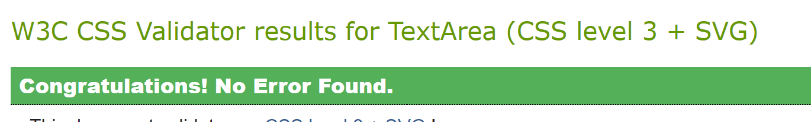
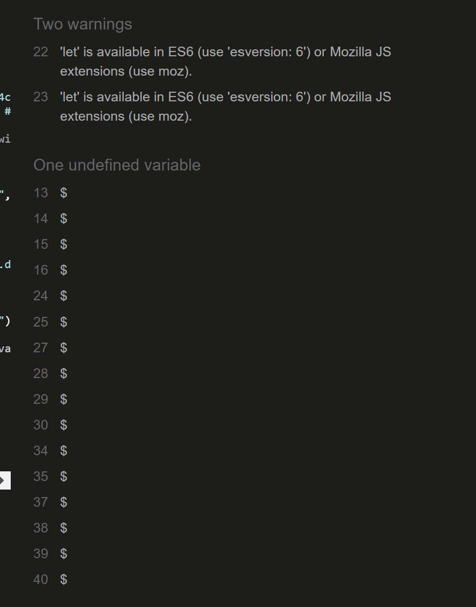
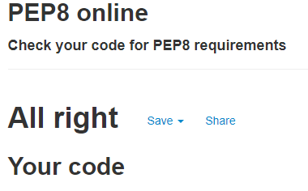

# Covidopedia – the covid-19 glossary

We all know far more than we would ever have wanted to about covid-19, coronavirus, and SARS-CoV-2. It is possible to hope that, at least in western countries, we will soon be leaving all that behind. Of course, it may be that it is with us for a lot longer. The global pandemic has introduced many of us to new subject areas and vocabularies  - epidemiology and infectious disease, statistics, biotechnology, medicines regulation, health economics, and health planning. Not only that, but we know quite a lot of detail – polymerase chain reaction tests vs lateral flow tests, and deeper in, sensitivity vs specificity, and in further, to positive predictive value vs negative predictive value. Meanwhile, politicians and celebrities have continued to make their own special contributions that have heartened, amused, and horrified us. 

So here it is, the glossary that brings all that together. Yes of course all the terms could be googled. But what of the actors? Can we understand covid in the UK without Dominic Cummings’ eye test or Matt Hancock’s kiss? Surely a glossary should have a place for the terms “Donald Trump” and “bleach”? And what of unlikely heroes or villains like Anders Tegnell and Shi Zhengli?

The website would provide a platform to gather this information together. With the site’s users acting as contributors, a much wider range of terms and definitions could be assembled than with just one individual or team. While remaining as scientifically accurate and well informed as possible, it would include the humorous and cultural aspects of covid. After all, it has affected the lived experience of a large part of humanity, so we need to think of it as social and cultural.

It could all come together into a book at some point. Selling that for money would not be an aim of the site, though.

**To test the site, create an account if you wish with a fictional name and password, or use one of the users I’ve created, that have added the terms to the database**
* James Lancaster : jameslancaster@outlook.com : covid1015!
* Maeve Maccoll : maevemaccoll@gmail.com : covid137!
* James Peter : james@rubywhite.com : covid1018!
* admin : admin@admin.com : covid11!

# User experience (UX)

## User stories
### 1. As a first time visitor I would like to
* easily understand the main purpose of the site and be reassured that I have found a site which may have what I am looking for
* be able to register a new account easily and straightforwardly
* be able to easily navigate throughout the site to find content
* make searches and easily find definitions
* contribute a new term, with definition and other information
* edit or if necessary delete terms that I’ve created
* if need be, contact website administrator

### 2. As a returning visitor, I would like to
* continue the activities of the first visit, including searching, contributing, and editing
* return to any earlier to contributions to edit them

## Strategy (user needs and business objectives)
1. In the first instance, the website facilitates a shared pleasure in the language, culture, and science of covid-19. To be effective in this, a number of criteria must be met
* Definitions on the site must be, as appropriate, scientifically accurate and truthful
* Definitions must not contain offensive language
* Definitions about individuals must not be defamatory
* Additional reference material and links should where possible be provided
All of these require at least one site administrator to edit and remove where necessary contributions that don’t meet these criteria, with appropriate permissions to be able to do this.

2. The user stories envisage an audience of no particular age demographic or background. Visitors are unlikely to be specialists in the medical and scientific aspects of covid, but simply those who have taken an active interest in current affairs during the pandemic. There are two broad activities for visitors, though
* Those who wish only to read information and use the site for reference or entertainment
  * Simple search function
  * Good cross-referencing
* Those who wish, perhaps in addition to reading and taking information, to contribute to definitions through their creation or editing
  * Simple search function
  * Straightforward creation of new terms
  * Straightforward editing of existing terms

## Scope (functional specifications and context requirements)
1. At its most basic, the website must simply provide definitions of covid-19 terms
* Terms
* Abbreviations
* Spelling out of abbreviations
* Main definitions
* One or more supplementary definitions
* One or more images, diagrams, or tables
* Reference source
* Further information
* “See also” – ie, a cross-referencing section

Not all references will have all these fields, and there may be more than one of each type of field – for instance, a few different suggestions for further information. Furthermore, contributors may identify other fields necessary for particular entries. NoSQL would be an appropriate data management approach, using MongoDB, because of the variety of subjects.

2. Registration
* There must be a way for the users to register a password-protected account.

3. Log in
* Once registered, users must  be able to easily login to their own space and to create and edit terms. Different menu options would be available.

4. Log out
* Logging out should be straightforward.

5. Search & retrieve
* The search function must be clear and intuitive. In its early stages the glossary does not require a complex search function: however, it may be appropriate to build a potential complex search function later.

6. Create
* The site must allow users to create new terms and submit them to the database

7. Edit and update records
* The site must allow users to edit existing entries, either their own of those submitted by others.

8. Some users will find it helpful or necessary to contact the site administrator 
* A contact email

9. Aspects to save till later:
* A blog might be of interest, perhaps discussing in detail a particular definition, or perhaps considering the difficulties around conflicting definitions.
* Administrator moderation
  * One or more administrators must be able to moderate and if necessary edit or delete entries submitted by users that do not follow site requirements.
* Flag entries for moderation
  * Users must be able to request moderation on posts they consider to  breach site rules.
* Increase in
  * number of fields and cross-referencing;
  * choice category or cross referencing “see also” term

## Structure (interaction and information design)
1. The site has a simple structure, one layer deep.

Users will arrive on the home page (also referred to as “glossary” in the menu. From here they have two basic choices: register or login. Once registered, they can login and a different menu is available: they create a new term, visit their profile page, or log out.

2. Home
* Welcome text
* Search the glossary

3. Register
* Registration form

4. Login
* Login form

5. Profile (when logged in)
* List of terms created
* Within those terms, the option to edit or delete

6. Add new
* Form to create a new term

7. Logout
* Logs the user out and takes them back to the login page

## Skeleton (interface, navigation, and information design)
1. Wireframe mock-ups were developed on [Figma]( https://www.figma.com/file/t23RDdsQOpbkhKUWJZBdm4/Coronapedia?node-id=1%3A2)
* Using Materialize forms and cards, I found that the blank, very clean design I started with looked unclear and unfocused, once there was a list of terms. So I preferred to keep the borders and shading of the Materialize elements most of the time.
* Switching the navbar title ‘covidopedia’ from right on large screens to centre on small screens proved awkward with a Materialize navbar, once the logo was added to the left, and with the need for a toggle menu on the right, so I left it on the left, which looks preferable.
* See wireframe at [Figma](https://www.figma.com/file/t23RDdsQOpbkhKUWJZBdm4/Coronapedia?node-id=1%3A2) 

2. Colour scheme and imagery
* The colour scheme is simple, with a purple in part complementing the logo. While it shouldn’t be overly formal, neither should it be jolly or light-hearted. Hence there’s only one colour, purple (in Materialize deep-purple darken-3), with occasional grey for buttons. Font is black or purple, apart from some flash messages in a dull red.

3. Image
* Only one image is used, the logo in the navbar, which is a slightly unusual version of SARS-CoV-2 highlighting its spikes, taken from [Cai Y, Zhang J, Xiao T, et al. Distinct conformational states of SARS-CoV-2 spike protein. Science 2020;369:1586](https://doi.org/10.1126/science.abd4251)

4. Fonts
* Two variable Google Fonts were chosen, which go well together, the more relaxed Dosis for the header, and the neater but not quite formal Assistant for much of the form text. Sans Serif is the fallback font in case the font isn't imported into the site correctly.

## Surface (visual design)
1. The header includes a logo as described above, containing the home page link. On larger screens there is a navigation bar, and on smaller screens a toggler icon leading to the navigation.

2. On all screen sizes the footer contains just an email link and a copyright notice. Nothing else is relevant for this project. The footer is differentiated from the body of the page simply by a grey line.

3. The Home page, also the Glossary, is presented as relatively uncluttered, with simply a welcome message, a search bar, and the glossary itself.

4. The Register page simply displays a white form on white background, with minimal design, and just a little bit of red text to draw it to the user’s attention if necessary.

5. The Login page is very similar to the Register page in colour and design, again with the small among of red text.

6. The Profile page follows the same format as the Glossary/Home page, similar to the login and register pages.

7. The Add New page again just uses the white form on a white background, with the same colour scheme.

# Data
The NoSQL database [MongoDB]( https://www.mongodb.com/) was used. A database was created with three collections: categories, terms, and users.

## Categories collection
The fields used in ‘categories’ are:
* _id
* category_name

Categories, which are used to group together related terms, can only be created or deleted by the admin (admin@admin.com). When creating or editing terms, users can assign the term to a particular categories.

## Terms collection
The fields used in ‘terms’ are
* _id
* term_name
* definition_01
* see_also_01
* source_01
* source_name_01
* category_name
* created_by

Once registered and logged in, a user is able to access the Add New page to create a new term, adding to any field. see_also and category_name are dropdown menus, the first to suggest links to similar terms, the second to assign the term to a category.

Terms can be searched for and retrieved using the search function Glossary page by any user, whether logged in or not.

Terms can be updated within the terms themselves using the edit button. This view is only available when logged in, and looking at terms created by the user. They are visible either on the profile page, or in the glossary, when only the terms created by the user have the edit button.

Terms can be deleted in the same way as they can be updated, by logged in users from their profile pages or from the glossary. Each of the terms they created has a delete button.

## Users collection
When registering an account, the user provides:
* first name (for greetings)
* last name
* email (used as the unique identifier
* password (hashed)

# Features

## Existing features
1. Responsive on all devices
2. The header contains a conventionally placed logo in the top left hand corner (with a link to send users to the home page). Navigation is in the top right of the page.
3. The footer contains an email link
4. Home page
* Search function to search the MongoDB database
* Pulls the terms from the database
* Ability to edit and delete terms, saving changes to the database
5. Register page
* A form to create an account, including name, email, and password
6. Login page
* A form to login in, requesting email and verifying the password (using Werkzeug functionality)
7. Profile page
* Welcomes the user by first name from registration
* Pulls in terms the user has created
8. Add New page
* Allows the user to add a new term to the database; also to cancel the action
9. Logout, and redirection to the Login page.
10. New categories can be created by the admin.

## Features left to implement
1. An improved search facility with
* Wildcard search
* An alphabetical list for a quick search
* Improved control of deletion
  * Confirmation modals, ie, “are you sure you wish to delete this?”
  * Possible change to deletion so that only admin can delete, or admin in addition to the user

## Issues and bugs
A challenging issue was the failure of the edit function, whereby the form could be completed but not submitted. With Tutor Support, I
* Checked all html in W3C Markup Validator, where any errors were not relevant to this problem
* Checked the POST method in the template and function, and found it wasn’t printing or activating at all, despite looking fine when inspected in DevTools
* Observed in the terminal that the GET method was 
* Removed the action sending referring to the edit_terms URL from the template
* At this point, identified in DevTools that the code in the categories selection dropdown ‘<option value="" disabled selected></option>’ was causing the error. This was puzzling to me because without it the dropdown defaults to the first item, and it is used twice in the code.

# Technologies used
## Languages
* HTML5
* CSS3
* JavaScript

## Frameworks, libraries & programs
* Gitpod
* [Git] https://git-scm.com/)
  * Git was used for version control by utilizing the Gitpod terminal to commit to Git and Push to GitHub.
* [GitHub](https://github.com/)
  * GitHub is used to store the projects code after being pushed from Git.
* Heroku
  * The site is deployed on Heroku

* [MongoDB](https://www.mongodb.com/)
* [MongoDB Atlas](https://www.mongodb.com/cloud/atlas)
* [BSON](https://bsonspec.org/)
  * BSON is required for MongoDB

* [jQuery](https://jquery.com/)
  * jQuery was used to simplify the use of JavaScript
* [Flask](https://flask.palletsprojects.com/en/2.0.x/)
  * Flask is the framework used to build and run the website
* [Werkzeug](https://werkzeug.palletsprojects.com/en/2.0.x/)
  * Password hashing and authentication is done using Werkzeug
* [PyMongo](https://pypi.org/project/pymongo/)
  * MongoDB is linked to Python via PyMongo
* [Jinja](https://jinja.palletsprojects.com/en/2.10.x/) 
  * Jinja templating language was used to simplify and display backend data in html

* [Materialize](https://materializecss.com/)
* [ Google Fonts](https://fonts.google.com/)
  * Google Fonts was used to import into style.css the variable fonts used throughout (Dosis and Assistant)

* [Figma](https://www.figma.com/)
  * Figma was used to create the wireframes during the design process.

# Testing
## Validators
1. W3c Markup Validator – results
* base.html – Bad value and Text not allowed in element errors; others corrected
* categories.html – Bad value errors; no others
* edit_category.html Bad value errors; others corrected
* edit_term.html – Bad value and Text not allowed in element errors; no others
* login.html – errors caused by a “ in the password
* new_category.html – errors corrected
* new_term.html – errors corrected
* profile.html – okay
* register.html - errors caused by a “ in the password
* terms.html - okay

2. W3C CSS Validator – results

3. JSHint
Okay – two warnings for use of “let”

4. PEP8 Online

## Testing user stories
### 1. As a first time visitor I would like to
* easily understand the main purpose of the site and be reassured that I have found a site which may have what I am looking for
* be able to register a new account easily and straightforwardly
* be able to easily navigate throughout the site to find content
* make searches and easily find definitions
* contribute a new term, with definition and other information
* edit or if necessary delete terms that I’ve created
* if need be, contact website administrator

#### Response
* On entering the site, I can see “Welcome to covidopedia” and a brief welcome message giving a sense of the purpose of the site and its general mood.
* I can see in the top right hand corner of the navbar a registration link. From this, I can click on a page and register straightforwardly.
* Once logged in, which is straightforward with the email and password, I can see the navigation of Glossary, Profile, Add New, and Log Out; the in the top left hand is also a link to the home page / Glossary.
* Searches are made from the Glossary page
* Terms can be contributed by clicking on the Add New link; the page presents a form with the required fields.
* To edit terms, I can return to my profile page, where they can all be edited, or can select them from the terms in the Glossary, as the terms I created give me the option to edit them. Editing presents a similar form to the Add New form.
* I can delete terms in the same way as edit them – the buttons are next to one another. 
* The only way to contact the website administrator is via email in the footer.

### 2. As a returning visitor, I would like to
* continue the activities of the first visit, including searching, contributing, and editing
* return to any earlier to contributions to edit them

### Response
* there is no additional functionality; the first visit shows what there is, and users will be able to come back, edit or delete their terms or create new ones, as well as consult terms in the glossary created by other users.

## Further testing
1. For desktop and laptop, the website was tested on Google Chrome, Microsoft Edge, Mozilla Firefox, and Safari browsers
2. For mobile phones, the website was tested on Google Chrome, Microsoft Edge, Mozilla Firefox, and Opera on Android, and Safari on iPhones. 
3. Links were extensively checked and layout examined
4. Friends and family were asked to comment on the site, and carried out the Safari browser tests.

## Known bugs
1. The search bar is too narrow on the mobile screen
2. Formatting of the forms for editing and adding terms; at the moment they are inconsistent, probably due to an unresolved conflict between my formatting and that in Materialize; I have not been able to find the reason.
3. The glossary now returns a "None" entry for the 'see_also' field. This may be due to an error in the 'see_also' code, but I note that it started after I deleted all entries and recreated them made by a range of users as a test.

# Deployment
## Database creation with MongoDB Atlas
The application’s database, to which it is connected, is MongoDB Atlas.

1. On [MongoDB Atlas](https://www.mongodb.com/), if you don’t already have an account, click on ‘Try Free’ and create an account
  1. Start by creating a cluster of service that our database will run on, using the free service in ‘Shared Clusters’ then ‘Create a Free Cluster'.
  2. For cloud provider leave it as Amazon Web Services, or AWS, and choose your location
  3. Choose the free tier, Cluster Tier M0 Tier, 'free forever'
  4. Click ‘Cluster Name' to name and create the cluster

2. Go to 'Database Access' under the Security section
  * 'Add New Database User', use the default SCRAM authentication method by creating a username and password. Use only a combination of letters and numbers
  * Set user privileges to 'Read and Write to any Database'; 'Add User'.

3. Click 'Network Access' to whitelist the IP address and make sure that it has access to our database.
'Add IP Address', and 'Allow Access From Anywhere', partly because we're going to be accessing this from our workspace, and then later on Heroku.

4. Click on ‘Collections’, and click 'Add My Own Data'.
  * Name the database
  * Name the first collection. This and other collections will be the basis of the database

## Deploy the application to Heroku
The project is deployed to Heroku.

1. Set up the files that Heroku needs to run the application. First, a requirements.txt file is passed to  Heroku so it knows which applications and dependencies the app requires
  1.  In the terminal window (I use Gitpod)
‘pip3 freeze --local > requirements.txt’

2. The Procfile tells Heroku which file runs the app, and how to run it
  1. In the terminal window
‘echo web: python app.py > Procfile’
Make sure to delete a blank that may be added to the end of the Procfile.

3. At [Heroku](https://www.heroku.com/), if you don’t already have an account, create a free account

4. Create a new app on https://dashboard.heroku.com/apps. The name must be unique. Click ‘Create App’.

5. To connect the app, set up Automatic Deployment from the GitHub repository. Your GitHub profile should be displayed
  * Add the repository name, and click to connect to this app.

6. The environment variables should be within a hidden env.py file. To allow Heroku to read them:
  1. Click 'Settings', and 'Reveal Config Vars'
  2. Take the required variables from the env.py file:
  * IP: 0.0.0.0
  * PORT: 5000
  *
  * MONGO_URI: mongodb+srv://<username>:<password>@<cluster_name>.mnes5.mongodb.net/<database_name>?retryWrites=true&w=majority5
  * MONGO_DBNAME: <mongo_database_name>

7. From the terminal, add, commit, and push to the repository one by one
  1. Procfile
  2. requirements.txt

8. 'Enable Automatic Deploys', and click 'Deploy Branch'.

## GitHub pages - creating a clone
1. On GitHub, navigate to the main page of the repository.
2. Above the list of files, click Code.
3. To clone the repository using HTTPS, under "Clone with HTTPS", click the copy symbol
4. On your computer, open Git Bash
5. Change the current working directory to the location where you want the cloned directory.
6. Type 'git clone’, and then paste the URL just copied.

# Credits
## Code
1. Materialize was used for the main layout elements of the site – forms, cards, navbar, and buttons
2. 
3. The contact form is from Bootstrap
4. Videos – additional css from https://flaviocopes.com/ 
5. I benefitted greatly from closely looking at other students’ work, which my mentor shared with me
* The milestone project of Kesia Cardoso, https://thecryptopedia.herokuapp.com/glossary
* The README from the milestone project of Rebecca Tracey-Timoney, https://github.com/rebeccatraceyt/bake-it-til-you-make-it/blob/master/README.md   
6. In addition, I regularly consulted
* [StackOverflow](https://stackoverflow.com/)
* [W3Schools](https://www.w3schools.com/)
* [Geeks for Geeks](https://www.geeksforgeeks.org)

## Content
I created all the content, mostly from my own notes made over the last 18 months. Where I directly make use of a source, I provide it in the glossary itself. 

## Acknowledgements
a	Many thanks to my mentor Seun for clear and focused guidance
b	And many thanks to the tutor support team for hanging on in during some long and painful queries

James Lancaster 21 August 2021

Heroku deployment
https://covid19-glossary.herokuapp.com/

GitHub
https://github.com/james-lancaster/covidopedia

